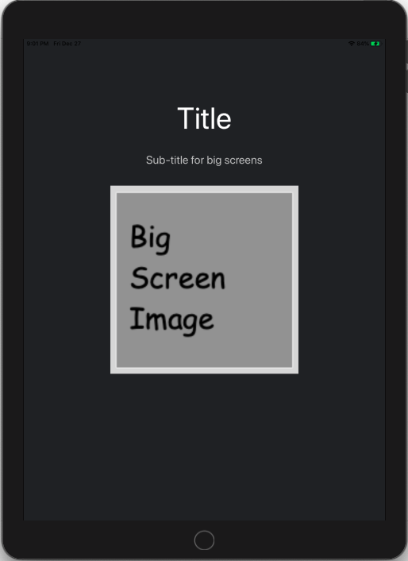
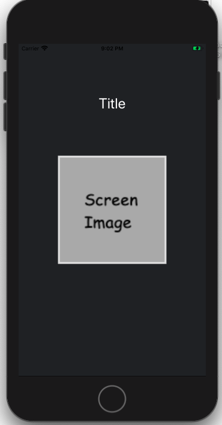
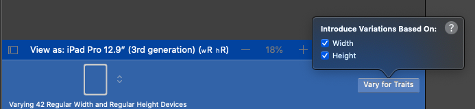
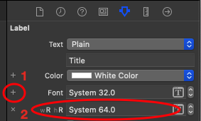
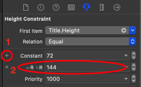
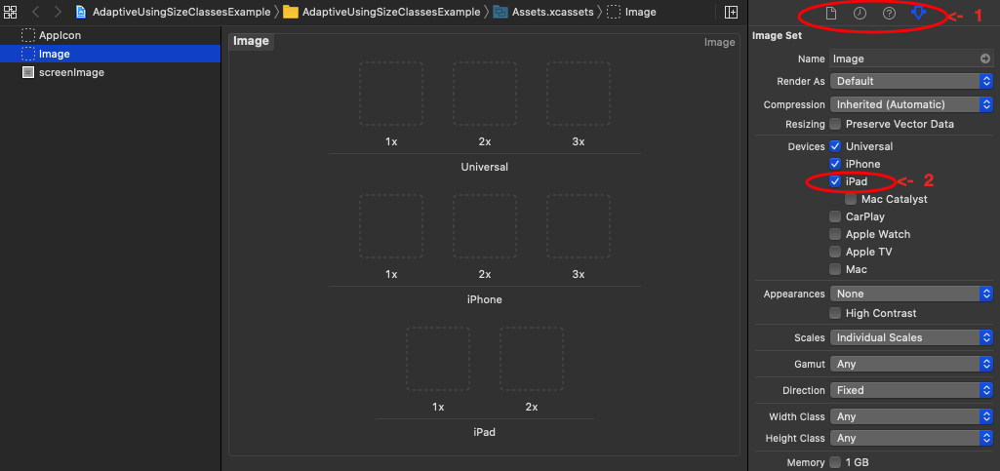

# Adaptive UI using Size Classes

* Costomized UI for big screen (eg. iPad Pro 9.7 inch).

 

## Notes:

**In storyboard:** Select an iPad view, click `Vary for Traits` button, and select both **width** and **height**. 

### Label font:

* Select the title label, then click `+` beside `Font` and set a larger font for **wR hR**.

			
### Constraint value:

* Select constraint value of title label, then click `+` and set a larger value for **wR hR**.

		
### New view:

* Add a new label as subtitle.

> since the option `Vary for Traits` is selected for regular width and height (eg. iPad Pro 9.7 inch),
> this **will not appear** on screens with compact width and height (eg. iPhone 5).
	
### Display different images for iPad and iPhone:

* In `Assets` folder, select the image set and show its  `Attributes inspector` , then add the required devices: (iPad or iPhone or both).

